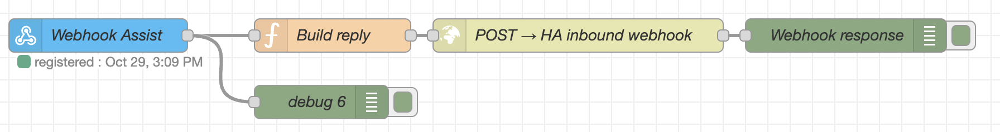

# Home Assistant Node Red Conversation - Webhook Integration

This **Home Assistant** integration enables conversational processing with **Assist** via **webhooks**, allowing you to use external services like **Node-RED** for message processing.

## Installation

### Via HACS (Recommended)

1. **Ensure HACS is installed**
   - If you don't have HACS installed, follow the [HACS installation guide](https://hacs.xyz/docs/setup/download/)

2. **Add this repository to HACS**
   - In Home Assistant, go to **HACS** → **Integrations**
   - Click the three dots menu (⋮) in the top right corner
   - Select **Custom repositories**
   - Add the following:
     - **Repository**: `https://github.com/therealkaufmann/home_assistant_node_red_conversation`
     - **Category**: Select **Integration**
   - Click **Add**

3. **Install the integration**
   - Search for "Home Assistant Node Red Conversation" in HACS
   - Click on the integration
   - Click **Download** to install it
   - Restart Home Assistant

4. **Add the integration**
   - Go to **Settings** → **Devices & Services**
   - Click **Add Integration**
   - Search for "Home Assistant Node Red Conversation"
   - Complete the setup wizard

### Manual Installation

If you prefer to install manually:

1. Copy the `custom_components/home_assistant_node_red_conversation` folder to your Home Assistant `custom_components` directory
2. Restart Home Assistant
3. Go to **Settings** → **Devices & Services** → **Add Integration**
4. Search for "Home Assistant Node Red Conversation" and complete the setup

## Configuration

1. Add the integration in Home Assistant
2. Configure the following options:
   - **Name**: A new conversation agent under this name will be selectable in Home Assistant --> Settings --> Voice-Assistant --> Assist
   - **Webhook Send ID**: The webhook ID where messages will be sent (Node-RED receives here)
   - **Webhook Receive ID**: The webhook ID where responses should be sent back to from Node-Red
   - **Timeout**: How long to wait for a response (seconds, default: 30)
   - **Error Message**: Message to display on timeout (default: "Error")
3. Select the new conversation agent in the assist settings

## Node-RED Setup

#### Node-RED Example Flow

You will find an example flow under [example-flow.json](https://github.com/TheRealKaufmann/home_assistant_node_red_conversation/blob/main/documentation/example_flow/example-flow.json)




### More Details

#### Receiving Messages

1. Create a **Webhook** node in Node-RED
2. Set the HTTP method to `POST`
3. Set the Path to your webhook ID (same as configured in "Webhook Send ID")
4. Leave the **Name** as is
5. **What it outputs:**
   ```json
   {
      request_id: (unique id, needs to be sent back in response json)
      message: (text message from assist)
      conversation_id: (conversation id from assist chat)
      satellite_id: (satellite id from voice satellites, 'null' if not available)
   }
   ```
5. Wire it to a function node or other processing logic

#### Sending Responses Back

To send a response back to Home Assistant, use an **HTTP Request** node:

1. Create an **HTTP Request** node in Node-RED
2. Configure it as follows:
   - **Method**: `POST`
   - **URL**: `http://localhost:8123/api/webhook/{WEBHOOK_RECEIVE_ID}`
     - Replace `localhost:8123` with your Home Assistant instance URL (can be localhost)
     - Replace `{WEBHOOK_RECEIVE_ID}` with your configured "Webhook Receive ID"
   - **Return**: `a JSON Object`
3. Set the **headers**:
   - Key: `Content-Type`
   - Value: `application/json`
4. For the **payload**, send the following JSON:
   ```json
   {
     "request_id": "{{msg.payload.request_id}}",
     "response": "Your response text here"
   }
   ```

#### How It Works

1. User sends a message in Home Assistant
2. Integration creates a unique `request_id` and sends to webhook (Webhook Send ID):
   ```json
   {
     "request_id": "01H...",
     "message": "Hello",
     "conversation_id": "...",
     "satellite_id": "satellite_123"  // Always included, null if not available
   }
   ```
3. Node-RED receives the message at the webhook endpoint
4. Node-RED processes the message
5. Node-RED sends response back via HTTP Request to webhook (Webhook Receive ID):
   ```json
   {
     "request_id": "01H...",  // Must match original request_id
     "response": "Hello back!"
   }
   ```
6. Integration receives the response and displays it in chat
7. If timeout occurs, shows the configured error message

## Important Notes

- **The `request_id` MUST match** between the original message and the response
- **Always send `request_id` and `response`** in the JSON payload
- The webhook accepts **JSON only**
- Responses must be sent within the configured timeout period
- The URL format must be exactly: `http://localhost:8123/api/webhook/{ID}`

## Troubleshooting

- Check Home Assistant logs for webhook reception
- Verify the webhook IDs match in configuration
- Ensure Node-RED can reach Home Assistant's webhook endpoint
- Check that `request_id` values match between send and receive